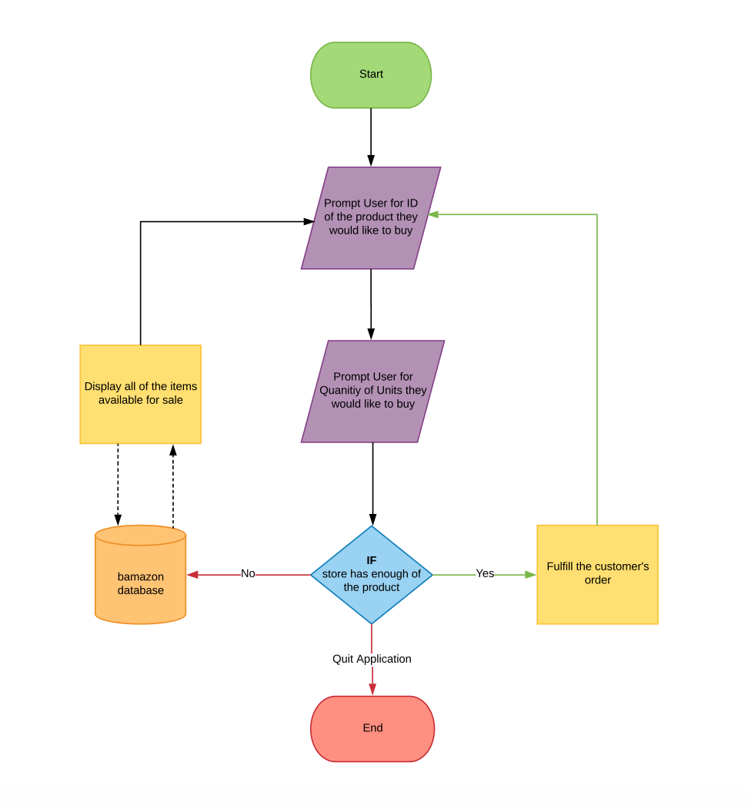

# Node.js-MySQL
[Find My Portfolio](https://iggy788.github.io/Bootstrap-Portfolio/index.html "Mike's Portfolio")
### How to Use the App!
1. Application will prompt you if you want to buy something or just quit.

2. If you choose to buy something the app will display a list of products for purchase and ask you to enter the ID of the product they would like to buy.

3. The app will then prompt you to enter the amount of the product they would like to buy.

4. Once you have selected your order, the application will check if the store has enough of the product to meet your request.

   * If the store has enough product to place your order you will see `Placing Your Order!` in GREEN.

        * If the store has enough product to place your order, your total cost will be calculated.

   * If the store does not have enough product to place your order you will see `Insufficient Quantity!` in RED.

5. After your order has been processed, the application will prompt you again if you want to buy something else or just quit.
- - -
### How the App Should Work!

- - -
### Install These Packages
1. npm install inquirer --save
   * [Inquirer](https://www.npmjs.com/package/inquirer)
2. npm install prompt --save
   * [Prompt](https://www.npmjs.com/package/prompt)
3. npm install mysql --save
   * [MySQL](https://www.npmjs.com/package/mysql)
4. npm install chalk --save
   * [Chalk](https://www.npmjs.com/package/chalk)
- - -
### Application Work Flow!

